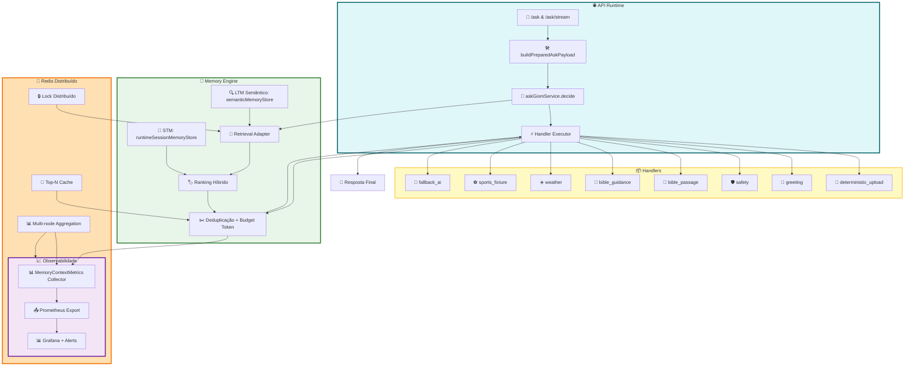

# 🌐 GIOM Big Tech Architecture Flow

**Visual representation of the complete GIOM pipeline with Decision Router, Memory Engine, Redis Cache, and Observability.**

---

## Complete Pipeline Flow



---

## Component Descriptions

### 🌐 API Runtime

- **`/ask`**: Standard synchronous request → JSON response
- **`/ask/stream`**: Streaming request → Server-Sent Events (SSE)
- **`buildPreparedAskPayload()`**: Normalize, validate, and enrich incoming payload
- **`askGiomService.decide()`**: **SINGLE Decision Router** → selects intent, handler, routeType
- **`Handler Executor`**: Routes to appropriate handler based on DecisionResult

### 📦 Handlers (Isolated Modules)

Each handler is independently deployed and executed:

- **deterministic_upload**: File upload operations
- **greeting**: Welcome/greeting messages
- **safety**: Content moderation & safety checks
- **bible_passage**: Scripture verse lookup (deterministic)
- **bible_guidance**: Scriptural guidance (AI-powered)
- **weather**: Current weather data
- **sports_fixture**: Event schedules & scores
- **fallback_ai**: Default LLM handler (always available)

### 🧬 Memory Engine

Core intelligence layer with hybrid ranking:

1. **STM (runtimeSessionMemoryStore)**: Session-scoped short-term memory
2. **LTM (semanticMemoryStore)**: Persistent semantic memory with pgvector embeddings
3. **Retrieval Adapter**: Queries STM + LTM, applies ranking
4. **Hybrid Ranking**: semantic (40–55%) + recency (20–25%) + importance (15–20%) + sourceBoost
5. **Deduplication**: Removes duplicates by role + content signature
6. **Token Budget**: Enforces token limits with intelligent fallback

### 🛑 Redis Distribuído

Distributed caching & coordination layer:

- **Top-N Cache**: Results cached with TTL, shared across nodes
- **Lock Distribuído**: Atomic lock prevents concurrent top-N recompute
- **Multi-node Aggregation**: Collects metrics from all nodes for dashboard

### 📈 Observabilidade

Complete observability stack:

- **MemoryContextMetrics Collector**: Captures latencies, percentiles, histograms, SLO
- **Prometheus Export**: Text format compatible with Grafana scrape
- **Grafana Dashboards**: Real-time monitoring + SLO violations
- **Alerting**: Automatic alerts on SLO breach, cache miss rate, lock timeouts

---

## Detailed Flow: Request to Response

```
1. REQUEST
   └─ POST /ask { query: "...", intent: null, ... }

2. PAYLOAD BUILD
   └─ buildPreparedAskPayload()
      ├─ Normalize text
      ├─ Validate length/format
      └─ Enrich context

3. DECISION ROUTER (SINGLE)
   └─ askGiomService.decide(payload)
      ├─ Analyze intent
      ├─ Select handler
      ├─ Determine routeType (deterministic/ai/stream)
      ├─ Determine requiresStreaming flag
      └─ Return DecisionResult

4. HANDLER EXECUTION
   └─ Handler Executor(decision)
      ├─ Call specific handler (weather, bible, ai, etc.)
      └─ Execute isolated logic

5. MEMORY ENGINE
   └─ Memory retrieval triggered
      ├─ STM lookup → hit/miss
      ├─ LTM semantic search → top-N candidates
      ├─ Hybrid ranking applied
      ├─ Deduplication removes duplicates
      ├─ Token budget enforced
      ├─ Cache lookup (local → distributed)
      ├─ Lock acquisition for distributed compute
      └─ Results cached + metrics recorded

6. REDIS CACHE & LOCK
   └─ Distributed coordination
      ├─ Lock NX (set-if-not-exists) for top-N compute
      ├─ Cache write on compute completion
      ├─ Multi-node aggregation for metrics
      └─ Lock release (safe cleanup)

7. METRICS COLLECTION
   └─ MemoryContextMetrics.record()
      ├─ Latency samples: retrieval, semantic, enrich, total
      ├─ Percentile calculation: p50, p75, p95, p99
      ├─ Histogram buckets: [10ms, 50ms, 100ms, 250ms, ...]
      ├─ Cache hit-rate tracking
      ├─ Lock wait-time recording
      ├─ SLO validation: p95/p99 vs budget
      └─ Multi-node aggregation via Redis scan

8. RESPONSE
   └─ Send back to client
      ├─ Format: JSON (if /ask) or SSE (if /ask/stream)
      ├─ Include memory diagnostics
      ├─ Include handler metadata
      └─ Close connection

9. PROMETHEUS EXPORT
   └─ /metrics/memoryContext?format=prometheus
      ├─ HELP texts
      ├─ TYPE declarations
      ├─ Histogram buckets (cumulative)
      ├─ Gauge metrics (with labels)
      └─ Per-node aggregation if includeDistributed=true
```

---

## Architecture Principles

✅ **Single Decision Router**

- No duplicate intent detection logic
- Controllers delegate to `askGiomService.decide()`
- Centralized, testable, auditable

✅ **Unified Pipeline**

- `/ask` and `/ask/stream` use identical flow
- Same handlers, same ranking, same memory engine
- Response format differs, logic identical

✅ **Distributed by Design**

- Redis multi-node support (single + cluster)
- Metrics aggregation across nodes
- Lock-based serialization for expensive compute

✅ **Observable First**

- Every stage measured: decide → retrieve → rank → response
- Percentiles tracked (p50/p75/p95/p99)
- SLO violations alerted automatically

✅ **Graceful Degradation**

- No single point of failure (fallback AI always available)
- Redis unavailable → local cache fallback
- Provider timeout → contingency response

---

## Data Flow: Intent Detection to Handler

```
Query: "Show me Psalm 23"
    ↓
Tokenize & Analyze
    ↓
Intent: "scripture_lookup"
    ↓
Handler selection: "bible_passage"
    ↓
Route type: "deterministic"
    ↓
requiresStreaming: false
    ↓
Execute handler → Return verse + commentary
    ↓
Record metrics → Cache result → Response
```

---

## SLO Tracking Architecture

```
Every Request
    ↓
Start timestamp
    ↓
Execute stages (decide → retrieve → rank → respond)
    ↓
Record latencies (retrieval_ms, semantic_ms, enrich_ms, total_ms)
    ↓
Calculate percentiles (p50, p75, p95, p99)
    ↓
Compare to budget:
  ├─ p95_retrieval vs 250ms
  ├─ p95_total vs 900ms
  └─ p99_total vs 1800ms
    ↓
If violation: slo.state = "violation", alarm added
    ↓
Export to Prometheus + Grafana
    ↓
Alert triggered if slo_violation_total > 0
```

---

## Cache Synchronization

```
Request 1 (Node A): Query "psalm 23"
    ↓
Cache miss, compute top-N
    ↓
Acquire distributed lock (Redis NX)
    ↓
Save to Redis with TTL=60s
    ↓
Release lock
    ↓
Response sent to client

Request 2 (Node B): Same query "psalm 23" (within 60s window)
    ↓
Cache hit from Redis (distributed)
    ↓
cacheLayer: "distributed"
    ↓
Response served immediately from cache
    ↓
No recompute, lock not needed
```

---

## Multi-Node Metrics Aggregation

```
Node A: p95_retrieval=300ms
Node B: p95_retrieval=280ms
Node C: p95_retrieval=320ms
    ↓
Aggregation (worst-case): p95_retrieval = 320ms
    ↓
Prometheus export:
giom_memory_context_p95_retrieval_ms{node="node_a",scope="distributed_local"} 300
giom_memory_context_p95_retrieval_ms{node="node_b",scope="distributed_local"} 280
giom_memory_context_p95_retrieval_ms{node="node_c",scope="distributed_local"} 320
    ↓
Grafana dashboard shows aggregate + per-node breakdown
```

---

## Technology Stack

| Layer | Technology | Purpose |
|-------|-----------|---------|
| Runtime | Node.js 18+ | API execution |
| API | Express.js | HTTP routing |
| Memory | PostgreSQL + pgvector | Semantic storage |
| Embeddings | OpenAI/Anthropic | Vector generation |
| Cache | Redis (single/cluster) | Distributed cache + locks |
| Observability | Prometheus + Grafana | Metrics + dashboards |
| Testing | Node test runner | Test suite |
| Build | TypeScript | Type-safe compilation |

---

## Next Evolutions

🚀 **Phase 2 - Advanced Observability**

- Jaeger/OpenTelemetry tracing
- Request-scoped correlation IDs
- Detailed span metrics per handler

🚀 **Phase 3 - ML-Driven Ranking**

- Learn ranking weights from user feedback
- A/B test ranking strategies
- Personalized ranking per user

🚀 **Phase 4 - Multi-Region**

- Redis Cluster across regions
- Cross-region cache replication
- Latency-aware routing

🚀 **Phase 5 - Advanced Caching**

- Query result table (materialized views)
- Probabilistic cache invalidation
- Semantic similarity bucketing

---

**Architecture Version:** 1.0 – Big Tech Level  
**Status:** Production Ready ✅  
**Last Updated:** 2026-03-30
